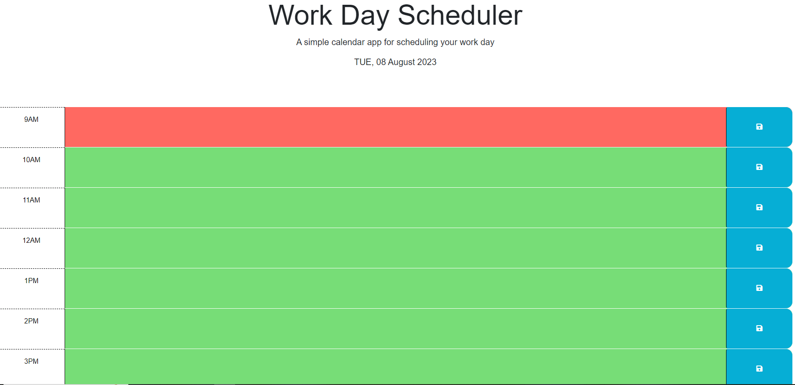

# Gustavo Daily Planner

## Description

This project was created with the purpose of saving future events for each day in a user-friendly interface that empowers you to manage your schedules with ease. It helps you to plan your day by creating tasks allocated in time slots, and organizing your priorities. 

## Table of Contents

- [Installation](#installation)
- [Usage](#usage)
- [Credits](#credits)
- [License](#license)

## Installation

This application does not required to be installed. This is a web application accessible to anyone worldwide.

## Usage

When entering the website, user is presented with a single-page work day scheduler with current date. Next, user is presented with colored time slots from 9am to 5pm for planning ahead. Grey slots are past, red are present, and green will be future events. Users can click inside each time slot to create an event. On the right of each time slot, users are presented with a save button. This saves the new event into local storage for future reminder. After pressing the save button, a text appears at the top of the planner with the message "Appointment saved into LocalStorage".

## Credits

- Stack Overflow [https://stackoverflow.com/]
- W3schools [https://www.w3schools.com/]
- Youtube [https://www.youtube.com/watch?v=AUOzvFzdIk4], [https://www.youtube.com/watch?v=MGstKhPoiho&t=627s]

## License

Gustavo Daily Planner is released under the MIT License. Feel free to use, modify, and distribute the code as per the terms of the license.